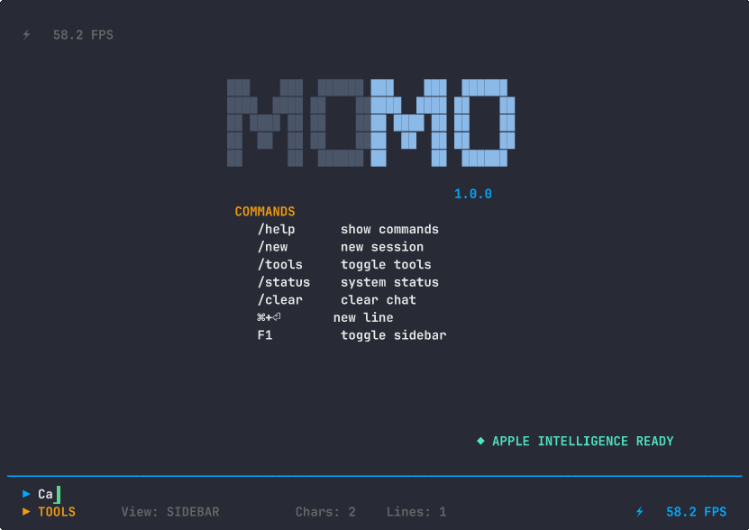

<p align="center">
 <a href="https://libai.sh">
    <picture>
      
    </picture>
  </a>
</p>
<p align="center">Apple Intelligence for any programming language</p>
<p align="center">
  <a href="https://github.com/6over3/libai"></a>
  <a href="https://libai.sh"></a>
  <a href="https://github.com/6over3/libai/releases"></a>
</p>

---

A C library that provides access to Apple Intelligence on-device Foundation models for any programming language or application.

## Overview

libai bridges Apple's FoundationModels framework through a C interface, enabling developers to integrate Apple Intelligence capabilities into applications written in C, C++, Python, Rust, Go, or any language that supports C bindings.

The library provides direct access to on-device AI models without requiring network connectivity or external API calls. All processing occurs locally on the user's device. 

The library provides direct access to on-device AI models without requiring network connectivity or external API calls. All processing occurs locally on the user's device. It supports Intel Macs, Apple Silicon devices including MacBooks, iPhones, and iPads, as well as Apple Vision Pro.
Supported platforms:

- iOS 26.0+
- iPadOS 26.0+
- Mac Catalyst 26.0+
- macOS 26.0+ (Intel and Apple Silicon)
- visionOS 26.0+

## Features

The library centers around session management. Applications create isolated AI sessions with independent configurations. Text generation operates in both synchronous and asynchronous modes with streaming callbacks available for real-time interfaces.

Structured response generation ensures AI output conforms to predefined JSON schemas. The library validates responses and provides both text and structured object representations.

Tool integration enables AI models to execute functions and interact with external systems. Applications can register native C callback functions as compile-time tools or utilize external MCP servers for runtime tool integration.

Tool definitions use JSON schemas following the Claude tool format for parameter validation and documentation.

**System Requirements:** macOS 26.0 or later with Apple Intelligence enabled.

## Installation

```bash
# Download latest release
curl -L https://github.com/6over3/libai/releases/latest/download/libai.tar.gz | tar xz

# Build from source
git clone https://github.com/6over3/libai.git
cd libai
make
```

## Quick Start

```c
#include "ai.h"

// Initialize library
ai_init();

// Create context and session
ai_context_t *ctx = ai_context_create();
ai_session_id_t session = ai_create_session(ctx, NULL);

// Generate response
char *response = ai_generate_response(ctx, session, "Hello", NULL);
printf("%s\n", response);

// Cleanup
ai_free_string(response);
ai_context_free(ctx);
ai_cleanup();
```

## Streaming Example

```c
#include "ai.h"

void stream_callback(ai_context_t *context, const char *chunk, void *user_data) {
    if (chunk) {
        printf("%s", chunk);
        fflush(stdout);
    } else {
        printf("\n[Generation complete]\n");
    }
}

int main() {
    ai_init();
    
    ai_context_t *ctx = ai_context_create();
    ai_session_id_t session = ai_create_session(ctx, NULL);
    
    // Stream response
    ai_stream_id_t stream = ai_generate_response_stream(
        ctx, session, "Tell me a story", NULL, stream_callback, NULL);
    
    // Wait for completion or cancel if needed
    // ai_cancel_stream(ctx, stream);
    
    ai_context_free(ctx);
    ai_cleanup();
    return 0;
}
```

## Tool Calling Example

```c
#include "ai.h"

// Tool callback function
char *get_weather_tool(const char *parameters_json, void *user_data) {
    // Parse parameters_json to extract location
    // Call weather API or return mock data
    return strdup("{\"temperature\": 72, \"condition\": \"sunny\"}");
}

int main() {
    ai_init();
    
    ai_context_t *ctx = ai_context_create();
    
    // Configure session with tools
    ai_session_config_t config = AI_DEFAULT_SESSION_CONFIG;
    config.tools_json = "[{\"name\":\"get_weather\",\"description\":\"Get weather for a location\",\"input_schema\":{\"type\":\"object\",\"properties\":{\"location\":{\"type\":\"string\"}},\"required\":[\"location\"]}}]";
    
    ai_session_id_t session = ai_create_session(ctx, &config);
    
    // Register tool callback
    ai_register_tool(ctx, session, "get_weather", get_weather_tool, NULL);
    
    // Generate response that may use tools
    char *response = ai_generate_response(ctx, session, "What's the weather like in San Francisco?", NULL);
    printf("%s\n", response);
    
    ai_free_string(response);
    ai_context_free(ctx);
    ai_cleanup();
    return 0;
}
```

## Structured Response Example

```c
#include "ai.h"

int main() {
    ai_init();
    
    ai_context_t *ctx = ai_context_create();
    ai_session_id_t session = ai_create_session(ctx, NULL);
    
    // Define JSON schema for structured output
    const char *schema = "{\"type\":\"object\",\"properties\":{\"name\":{\"type\":\"string\"},\"age\":{\"type\":\"number\"}},\"required\":[\"name\",\"age\"]}";
    
    // Generate structured response
    char *response = ai_generate_structured_response(
        ctx, session, "Extract name and age from: John Smith is 30 years old", schema, NULL);
    
    printf("Structured response: %s\n", response);
    
    ai_free_string(response);
    ai_context_free(ctx);
    ai_cleanup();
    return 0;
}
```

## Demo Application: momo

Included with libai is momo, a terminal user interface that demonstrates the library's capabilities. momo functions as Cursor in your terminal, powered by your local Apple Intelligence model.

The application provides real-time streaming responses with markdown rendering, tool calling support with both built-in utilities and MCP server integration, and multi-line input handling with syntax highlighting.

```bash
curl -sSL https://raw.githubusercontent.com/6over3/libai/main/install-momo | bash
```

```bash
# Then run it
momo
```

```bash
make && ./build/dynamic/arm64/release/momo
```

## Tool Calling

libai supports tool integration through two mechanisms:

**Native C Functions:** Register callback functions directly with AI sessions. The library handles parameter marshaling and JSON schema validation.

**MCP Servers:** Integrate external tools through Model Context Protocol servers that run as separate processes and communicate via stdio.

## Language Support

Check which languages Apple Intelligence supports on your device:

```c
int count = ai_get_supported_languages_count();
for (int i = 0; i < count; i++) {
    char *language = ai_get_supported_language(i);
    printf("Supported language: %s\n", language);
    ai_free_string(language);
}
```

## Availability Checking

Before using the library, check if Apple Intelligence is available:

```c
ai_availability_t status = ai_check_availability();
if (status != AI_AVAILABLE) {
    char *reason = ai_get_availability_reason();
    printf("Apple Intelligence not available: %s\n", reason);
    ai_free_string(reason);
    return -1;
}
```

## Error Handling

The library provides comprehensive error handling:

```c
ai_result_t result = ai_init();
if (result != AI_SUCCESS) {
    printf("Initialization failed: %s\n", ai_get_error_description(result));
    return -1;
}

// Check context-specific errors
char *response = ai_generate_response(ctx, session, "Hello", NULL);
if (!response) {
    printf("Generation failed: %s\n", ai_get_last_error(ctx));
}
```

## Build Requirements

- Xcode 26.0 or later with Swift 6.0 support
- C11 compatible compiler  
- FoundationModels framework (macOS 26.0+)

## Documentation

API documentation appears in the header files with parameter descriptions, return value specifications, and memory ownership requirements. See `ai.h` for the complete API reference.

## Technical Considerations

The underlying Apple Intelligence models operate with a 4096 token context limit. While session chaining can help manage longer conversations, developers should carefully consider this constraint in their implementation design.

Looking forward, as on-device AI models expand to additional platforms like Windows and Android, this library is designed to support those ecosystems through a unified abstraction layer.

---

**Made by** [6over3](https://6over3.com)
